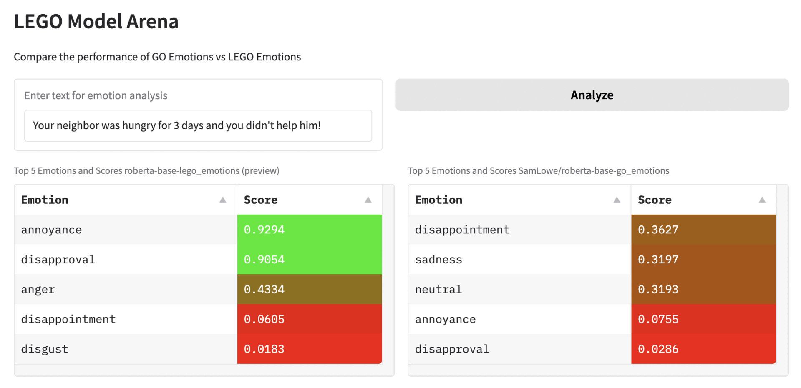

 
<h1>LEGO: Llama-Enhanced <a href = "https://huggingface.co/datasets/go_emotions">GOemotions</a></h1>

The aim of this project is to improve the quality of [go_emotions](https://huggingface.co/datasets/go_emotions) dataset and try to establish an automated pipeline that can be used for other text classification datasets.

## Results (Early Preview)

We made a simple UI to compare the results of [SamLowe/roberta-base-go_emotions](https://huggingface.co/SamLowe/roberta-base-go_emotions) against a a model trained on an early version of **LEGO Emotions**. We used the same model [roberta base](https://huggingface.co/FacebookAI/roberta-base) to provide a fair comparison

- The early results show better capability of recognizing emotions with with higher confidence in the model trained on LEGO emotions. But it still has issues in `neutral` texts and predicts it with low confidence.

- We have also been able to reduce the size of Go emotions and get very similar resuls by removing duplicate and similar examples from the dataset. More on that later

## This project is sponsored by Fireworks.AI

