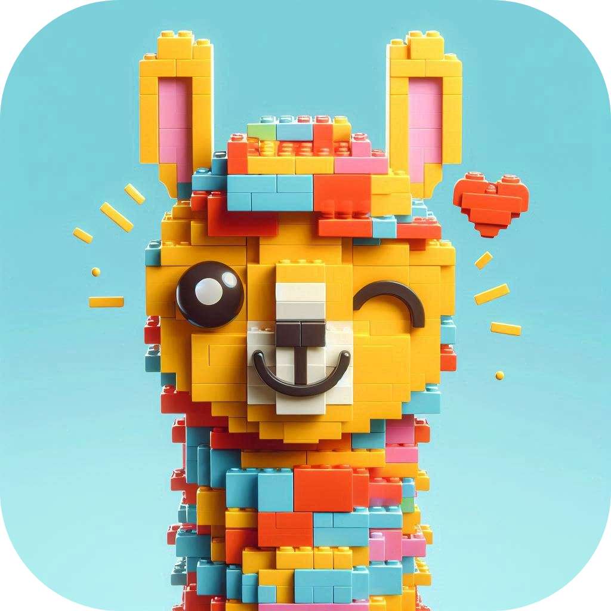

 
<h1>LEGO: Llama-Enhanced <a href = "https://huggingface.co/datasets/go_emotions">GOemotions</a></h1>

The aim of this project is to improve the quality of [go_emotions](https://huggingface.co/datasets/go_emotions) dataset and try to establish a pipeline that can be used for other text classification datasets.